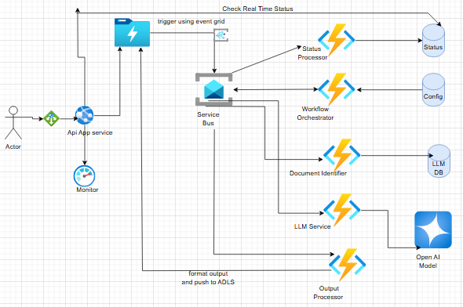

# System Design for Document Processor

## Components : 

1. Service Bus Topic
2. DataLake Storage (ADLS GEN 2)/Storage Account
3. Document Procssing Microservices
    a. Orchestrator Service
    b. Status Processor
    c. Document Identifier Service (uses Azure Document Intelligence)
    d. LLM Service
4. API Gateway/Api management
5. Observability - Azure Monitor, Application Insights
6. Reporting - Power BI, Grafana
7. Database - Azure tables No sql DB
        a. ConfigurationDB
        b. StatusDB - reporting purpose
        c. LLMServiceDB
8. Event Grid - to trigger service bus from Datalake storage

9. Architecture Diagram : 
 
 

## Functional 

1.  Azure Data Lake (Blob Storage) 
      ↓ (BlobCreated Event)
    Azure Event Grid
        ↓
    Azure Function (Event Grid Trigger)
        ↓
    Azure Service Bus (Queue or Topic)

2. Workflow Orchestrator gets triggered , Pulls Configurations from DB and as per tasks to be performed on document dumps events on service bus.
3. According to event dumped Document Processor micro service gets triggered.
4. After this as per the enrichment model, document processor will trigger LLM Processor service, which will talk to Open AI models.
   We will be providing ability to user or admin to modify the prompt as well as per type of enrichment user wants.
5. Sentiment analysis
6. Once LLM process is done it will dump the output event to Output Processor, which will fomat the output and push this to Datalake            output      folder.

    ## API
    1. we will also be having API to check real time status of request (api/checkStatus---> statusProcessorEndpoint)
    2. we will query datalake for output (api/datalakeOutput ----> Query datalake)

## Non Functional

 1. Document to be processed every 1 min.
 2. Multiple Documents should be processed at single point of time
 3. Application should autoscale in case of certain load + CPU threshhold.

 Deployment : 
 1. All the Services should be deployed on AKS Clusters
 2. CICD using helm charts , use Azure devops or GitHub Actions.
 3. CAP Theorem - DB is selected as no sql here either azure tables or cosmos consider high availability scenario.

 Security
 1. Data should be secure in rest and in transit both, use proper VNET + SNET + private endpoints (for connections)
 2. for Datalake polling use encryption key.
 3. Secrets should be in Azure Key Vault.
 4. API's should be secure(Azure Entra ID Authentication) + TLS
 5. PHI/PII/GDPR, sensitive data should be taken care as per Compliance policy.

 Monitoring + Reporting
 1. Use Azure Monitor , Azure Application Insights, Azure Alerts
 2. Automatic notifications using Azure Alerts in case of failure scenarios.
 3. Power BI or Grafana for Reporting.
