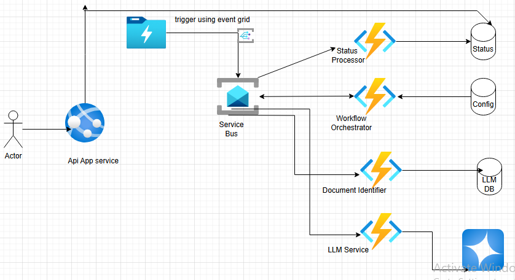

# Sytem Design for Document Processor

## Components : 

1. Service Bus Topic
2. DataLake Storage (ADLS GEN 2)/Storage Account
3. Document Procssing Microservices
    a. Orchestrator Service
    b. Status Processor
    c. Document Identifier Service (uses Azure Document Intelligence)
    d. LLM Service
4. API Gateway/Api management
5. Observability - Azure Monitor, Application Insights
6. Reporting - Power BI, Grafana
7. Database - Azure tables No sql DB
        a. ConfigurationDB
        b. StatusDB - reporting purpose
        c. LLMServiceDB
8. Event Grid - to trigger service bus from Datalake storage

9. Architecture Diagram : 
 